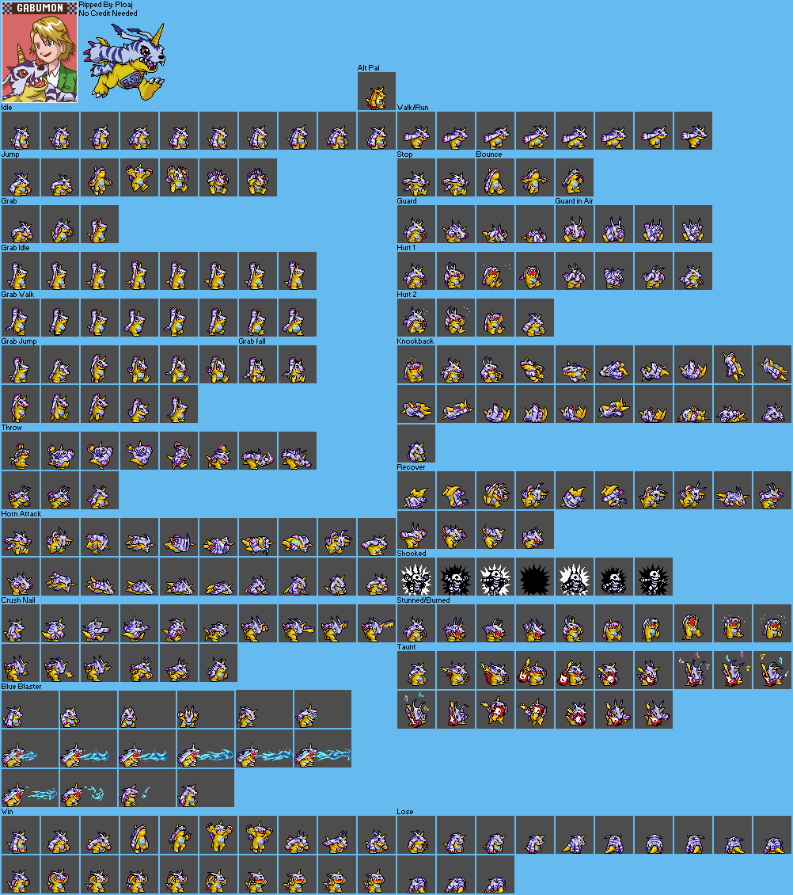

# AIBotPet

A desktop pet powered by AI. Pixel-art characters live on your screen — they walk, idle, react, and chat with you through any OpenAI-compatible API. Supports web search so your pet can answer real-time questions.

Built with Electron. No frameworks, just vanilla JS + Canvas.



## Features

- **Multi-pet support** — switch between Gabumon and Kirby (more can be added)
- Transparent, frameless, always-on-top window
- Sprite sheet animation engine with automatic background removal
- Pet state machine: idle, walk, jump, taunt, hurt, win, attack...
- AI chat via any OpenAI-compatible endpoint
- **LLM-driven web search** — the AI decides when to search (via PPIO Web Search API)
- Chat bubble with typewriter effect
- Smart chat positioning (flips above/below based on screen position)
- Drag the pet anywhere on screen
- Right-click pet to open settings

## Quick Start

```bash
git clone https://github.com/KoujiMinamoto/aibotpet.git
cd aibotpet
npm install
npm start
```

> If `npm install` fails downloading the Electron binary, try setting a mirror:
> ```bash
> ELECTRON_MIRROR="https://npmmirror.com/mirrors/electron/" npm install
> ```

## Controls

| Action | Effect |
|---|---|
| **Drag** | Move pet anywhere on screen |
| **Click** | Pet reacts (taunt animation) |
| **Double-click** | Open/close chat input |
| **Right-click** | Open settings panel |
| **Tray icon** | Settings / Quit |

## Settings

Right-click the pet to open Settings.

| Field | Description |
|---|---|
| **Pet** | Choose your pet (Gabumon / Kirby) |
| **API Base URL** | The API endpoint base URL (without `/chat/completions`) |
| **API Key** | Your API key (leave empty for local models) |
| **Model** | Model name to use |
| **Web Search Token** | PPIO API token for web search (optional) |
| **Pet Scale** | Sprite display scale (1-5) |

### AI Provider Examples

**OpenAI**
```
Base URL: https://api.openai.com/v1
API Key:  sk-xxxxx
Model:    gpt-4o-mini
```

**Claude (via OpenAI-compatible proxy / OpenRouter)**
```
Base URL: https://openrouter.ai/api/v1
API Key:  sk-or-xxxxx
Model:    anthropic/claude-sonnet-4
```

**DeepSeek**
```
Base URL: https://api.deepseek.com/v1
API Key:  sk-xxxxx
Model:    deepseek-chat
```

**Ollama (local)**
```
Base URL: http://localhost:11434/v1
API Key:  (leave empty)
Model:    llama3
```

**Groq**
```
Base URL: https://api.groq.com/openai/v1
API Key:  gsk_xxxxx
Model:    llama-3.3-70b-versatile
```

Any service that implements the `/chat/completions` endpoint in OpenAI format will work.

### Web Search

Fill in the **Web Search Token** field with a [PPIO](https://ppio.com) API token. The LLM will automatically decide when to search the web using function calling — for example when asked about weather, news, or real-time data. Leave empty to disable.

## Available Pets

### Gabumon
- Shy but loyal Digimon with Blue Blaster attack
- Scale: 3x (48px base frames)
- Animations: idle, walk, jump, taunt, hurt, recover, win, blueBlaster, shocked, and more

### Kirby
- Cheerful pink puffball from Dream Land
- Scale: 5x (~22px base frames)
- Animations: idle, walk, jump, taunt, hurt, win, inhale, float, run

## Adding a New Pet

Create a config file in `src/pets/yourpet.js`:

```javascript
window.PET_CONFIGS = window.PET_CONFIGS || {};

window.PET_CONFIGS.yourpet = {
  name: 'YourPet',
  spriteSheet: '../assets/yourpet.png',
  scale: 3,
  defaultFrameW: 48,
  backgrounds: [              // colors to remove, or [] if already transparent
    { r: 255, g: 0, b: 255 },
  ],
  bgTolerance: 12,
  animations: {
    idle: { frames: [{ x, y, w, h }, ...], speed: 180, loop: true },
    walk: { frames: [...], speed: 110, loop: true },
    // at minimum: idle and walk
  },
  emotionMap: {               // maps AI emotion tags to animation names
    happy: 'win', sad: 'hurt', angry: 'attack', greeting: 'taunt', neutral: 'idle', ...
  },
  stateTransitions: {         // what state to go to after a non-looping animation ends
    hurt: 'idle',
  },
  greeting: "Hi! Double-click me to chat!",
  clickReaction: { state: 'taunt', text: '*hello!*' },
  chatPlaceholder: 'Talk to YourPet...',
  systemPrompt: `You are YourPet... [emotion:TAG] ...`,
};
```

Then add the script tag in `src/index.html` and a `<option>` in `src/settings.html`.

## Project Structure

```
aibotpet/
├── main.js              # Electron main process (window, tray, IPC)
├── preload.js           # Context bridge (renderer ↔ main)
├── src/
│   ├── index.html       # Main page
│   ├── styles.css       # Styles (pet window + settings)
│   ├── renderer.js      # Game loop, input handling, pet switching
│   ├── sprite.js        # Generic sprite engine (load, animate, render)
│   ├── pet.js           # Behavior state machine
│   ├── chat.js          # Chat bubble UI
│   ├── ai-client.js     # AI client with function-calling web search
│   ├── settings.html    # Settings page
│   └── pets/
│       ├── gabumon.js   # Gabumon config (frames, AI personality)
│       └── kirby.js     # Kirby config (frames, AI personality)
└── assets/
    ├── gabumon.png      # Gabumon sprite sheet
    └── kirby.png        # Kirby sprite sheet
```

## How It Works

1. **Sprite Engine** loads the PNG, optionally removes background colors, and renders frames to a Canvas with pixel-art scaling

2. **Pet Configs** define everything per-character: frame coordinates, animations, emotion mappings, AI personality, and UI strings

3. **State Machine** drives autonomous behavior: idle → walk → jump → taunt. AI chat emotions override the current state via per-pet emotion maps

4. **AI Client** sends messages to any OpenAI-compatible `/chat/completions` endpoint. When web search is enabled, it passes a `web_search` tool definition — the LLM decides whether to call it. If triggered, the client executes the PPIO search and feeds results back for a final response

5. **Rendering** is bottom-aligned — sprites of different heights keep their feet anchored at the same position

## License

Gabumon sprite sheet ripped by Ploaj. Kirby sprite sheet ripped by Jackster. This project is for personal/educational use.
